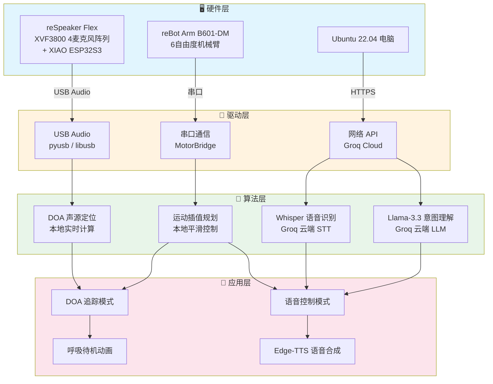
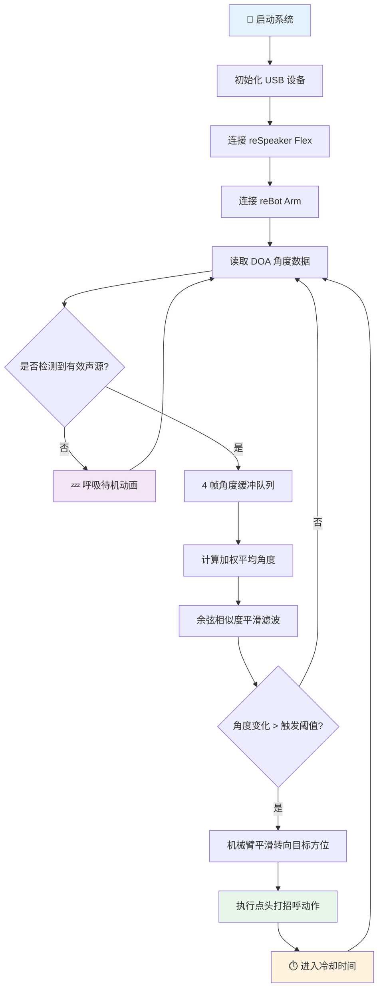
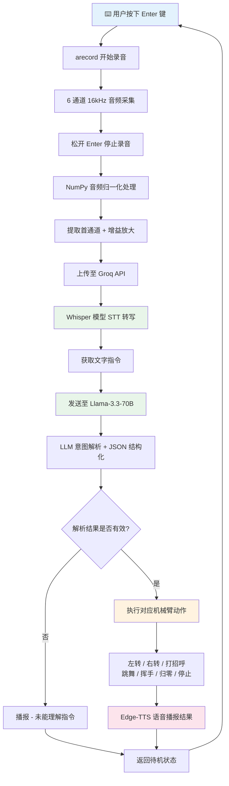

<div align="center">

🌐 **[English](./README_EN.md)** | **中文**

---

# 🎙️ reBot Arm + reSpeaker Flex

**声音驱动的智能机器人手臂 —— 基于 reSpeaker Flex 麦克风阵列的 reBot Arm B601-DM 控制方案**

[](https://www.python.org/downloads/release/python-3100/)
[](https://ubuntu.com/)
[](LICENSE)
[](https://groq.com/)
[](https://github.com/rany2/edge-tts)

</div>

---

## 📋 目录

- [项目简介](#-项目简介)
- [功能特性](#-功能特性)
- [系统架构](#-系统架构)
- [硬件清单](#-硬件清单)
- [快速开始](#-快速开始)
  - [环境准备](#1-环境准备)
  - [安装依赖](#2-安装依赖)
  - [配置 Groq API](#3-配置-groq-api)
  - [运行项目](#4-运行项目)
- [模式说明](#-模式说明)
  - [模式 1：DOA 声源追踪](#模式-1doa-声源追踪模式)
  - [模式 2：语音指令控制](#模式-2语音指令控制模式)
- [命令行参数](#-命令行参数)
- [项目结构](#-项目结构)
- [安全注意事项](#-安全注意事项)
- [技术栈](#-技术栈)
- [许可证](#-许可证)
- [致谢](#-致谢)

---

## 📖 项目简介

本项目是一个基于 **Python 3.10** 的智能机器人手臂控制系统，通过 **reSpeaker Flex**（XVF3800 四麦克风阵列）实现声音交互，精准控制 **reBot Arm B601-DM**（6 自由度机械臂）完成声源追踪与语音指令响应。

系统提供两种核心工作模式：
- **DOA 声源追踪模式**：利用麦克风阵列实时检测声源方位，机械臂自动转向声源并执行交互动作
- **语音指令控制模式**：通过语音对话控制机械臂完成左转、右转、打招呼、跳舞等多种预设动作

---

## ✨ 功能特性

- 🔊 **DOA 实时声源追踪** —— 基于 reSpeaker Flex 内置 DOA 算法，实时计算声源方位角
- 🤖 **6 自由度机械臂控制** —— 支持精准运动插值与关节角度限制保护
- 🎤 **6 通道 16kHz 高品质录音** —— 4 麦克风阵列同步收音，支持远场语音捕获
- 🧠 **AI 驱动的语音交互** —— 集成 Groq Whisper STT + Llama-3.3-70B 意图理解
- 🗣️ **中文语音合成播报** —— 基于微软 Edge-TTS 的流畅中文语音反馈
- 💤 **呼吸式待机动画** —— 无人交互时自动进入微动待机状态
- 🎯 **角度平滑滤波** —— 4 帧缓冲 + 余弦相似度滤波，消除 DOA 抖动
- ⏱️ **智能冷却机制** —— 防抖动触发阈值 + 冷却时间，避免频繁误触发
- 🔌 **纯 USB 通信** —— 无需额外驱动，即插即用
- 🖥️ **按钮式交互** —— 终端按 Enter 即可触发录音，操作简便

---

## 🏗️ 系统架构



> **架构说明**：系统采用四层分层架构设计，硬件层通过 USB/串口/网络与驱动层通信，算法层在本地和云端协同运行，应用层提供两种交互模式和动画效果。

---

## 🔧 硬件清单

| 组件 | 型号 | 说明 | 参考链接 |
|------|------|------|----------|
| 机械臂 | reBot Arm B601-DM | 6 自由度桌面级机械臂 | [官网](https://www.rebotix.com/) |
| 麦克风阵列 | reSpeaker Flex XVF3800 | 4 麦阵列，集成 XIAO ESP32S3 | [Wiki](https://wiki.seeedstudio.com/reSpeaker_USB_Mic_Array/) |
| 主控电脑 | Ubuntu 22.04 | x86_64 架构 | [下载](https://ubuntu.com/download/desktop) |
| USB 线缆 | USB-A to USB-C ×2 | 数据+供电 | — |

### 硬件连接示意图

```
┌─────────────────┐         USB          ┌──────────────────┐
│  reSpeaker Flex │ ◄──────────────────► │   Ubuntu 22.04   │
│  (XVF3800)      │     USB Audio        │   (Python 3.10)  │
│  4-Mic Array    │                      │                  │
└─────────────────┘                      │   ┌──────────┐   │
                                        │   │  Groq    │   │
┌─────────────────┐         USB          │   │  Cloud   │   │
│  reBot Arm      │ ◄──────────────────► │   │  (API)   │   │
│  B601-DM        │    Serial Bridge     │   └──────────┘   │
│  (6-DOF)        │                      └──────────────────┘
└─────────────────┘
```

---

## 🚀 快速开始

### 1. 环境准备

确保你的系统满足以下要求：

- **操作系统**：Ubuntu 22.04 LTS (x86_64)
- **Python 版本**：3.10（推荐通过 Conda 管理）
- **硬件连接**：reSpeaker Flex 和 reBot Arm 均已通过 USB 连接到电脑
- **网络**：可访问互联网（用于 Groq API 调用）

### 2. 安装依赖

#### 2.1 创建 Conda 环境

```bash
# 创建 Python 3.10 环境
conda create -n arm_voice python=3.10 -y

# 激活环境
conda activate arm_voice
```

#### 2.2 安装系统依赖

```bash
# 安装 libusb 和音频工具
sudo apt update
sudo apt install -y libusb-1.0-0-dev portaudio19-dev alsa-utils
```

#### 2.3 安装 Conda 科学计算包

```bash
# 安装 pinocchio、casadi 等依赖
conda install -c conda-forge pinocchio casadi libusb numpy scipy -y
```

#### 2.4 安装 Python 包

```bash
# 安装 Python 依赖
pip install pyusb groq edge-tts
```

### 3. 配置 Groq API

在项目根目录创建 `.env` 文件：

```bash
echo "GROQ_API_KEY=your_groq_api_key_here" > .env
```

> 💡 **获取 API Key**：前往 [Groq 控制台](https://console.groq.com/keys) 注册并创建 API Key。

### 4. 运行项目

```bash
# 激活环境
conda activate arm_voice

# 运行主程序（默认启动 DOA 追踪模式）
python sound_tracking_arm.py

# 启动语音指令控制模式
python sound_tracking_arm.py --mode voice

# 查看所有可用参数
python sound_tracking_arm.py --help
```

---

## 🎛️ 模式说明

### 模式 1：DOA 声源追踪模式

在此模式下，系统通过 reSpeaker Flex 的 DOA（Direction of Arrival）算法实时检测声源方位，驱动机械臂转向声源并执行交互动作。

#### 工作流程



#### 核心技术点

| 技术点 | 说明 |
|--------|------|
| 4 帧角度缓冲 | 使用环形缓冲区存储最近 4 帧 DOA 角度数据 |
| 余弦相似度滤波 | 计算角度向量的余弦相似度，过滤异常跳变 |
| 触发阈值 | 角度变化超过设定阈值才触发机械臂运动 |
| 冷却时间 | 动作执行后进入冷却期，避免连续误触发 |
| 呼吸待机 | 无人说话时机械臂进入周期性微动待机状态 |

---

### 模式 2：语音指令控制模式

在此模式下，用户通过语音指令控制机械臂执行各种预设动作。系统支持完整的 **录音 → 识别 → 理解 → 执行 → 播报** 闭环。

#### 工作流程



#### 支持的语音指令

| 指令类型 | 示例说法 | 执行动作 |
|----------|----------|----------|
| 转向 | "向左转" / "往右边看" | 机械臂基座左转/右转 |
| 问候 | "打个招呼" / "你好" | 执行点头打招呼动作 |
| 舞蹈 | "跳个舞" / "表演一下" | 执行预设舞蹈动作序列 |
| 挥手 | "挥挥手" / "说再见" | 执行挥手动作 |
| 归零 | "回到初始位置" / "复位" | 所有关节回到零位 |
| 停止 | "停下" / "不要动了" | 立即停止当前动作 |

#### 交互示例

```
$ python sound_tracking_arm.py --mode voice

========================================
  🤖 reBot Arm 语音控制系统已启动
  按 Enter 开始录音，松开结束
  按 Ctrl+C 退出
========================================

>> 请按住 Enter 说话... [用户按住Enter]
   🎙️ 正在录音... [用户松开Enter]
   ✓ 录音完成，正在处理...
   📝 识别结果: "向左边转一下"
   🤖 执行动作: 左转
   🔊 播报: "好的，正在向左转"

>> 请按住 Enter 说话...
```

---

## ⚙️ 命令行参数

```bash
python sound_tracking_arm.py [选项]
```

| 参数 | 简写 | 默认值 | 说明 |
|------|------|--------|------|
| `--mode` | `-m` | `doa` | 运行模式：`doa`（声源追踪）或 `voice`（语音控制） |
| `--device` | `-d` | `0` | reSpeaker Flex USB 设备 ID |
| `--port` | `-p` | `/dev/ttyUSB0` | 机械臂串口设备路径 |
| `--threshold` | `-t` | `15` | DOA 角度触发阈值（度） |
| `--cooldown` | `-c` | `3` | 动作冷却时间（秒） |
| `--buffer-size` | `-b` | `4` | DOA 角度缓冲帧数 |
| `--groq-key` | `-k` | `None` | Groq API Key（也可通过 .env 配置） |
| `--tts-voice` | `-v` | `zh-CN-XiaoxiaoNeural` | Edge-TTS 语音音色 |
| `--debug` | — | `False` | 启用调试日志输出 |
| `--help` | `-h` | — | 显示帮助信息 |

#### 使用示例

```bash
# DOA 追踪模式（默认）
python sound_tracking_arm.py

# 语音控制模式
python sound_tracking_arm.py --mode voice

# 自定义 DOA 触发阈值和冷却时间
python sound_tracking_arm.py --threshold 20 --cooldown 5

# 指定串口设备和 Groq API Key
python sound_tracking_arm.py --mode voice --port /dev/ttyACM0 --groq-key gsk_xxx

# 使用男声播报
python sound_tracking_arm.py --mode voice --tts-voice zh-CN-YunjianNeural

# 启用调试模式
python sound_tracking_arm.py --debug
```

---

## 📁 项目结构

```
reBot-Arm-reSpeaker-Flex/
├── 📄 sound_tracking_arm.py    # 主程序（包含所有核心类）
├── 📄 README.md                # 中文文档（本文件）
├── 📄 README_EN.md             # 英文文档
├── 📄 .env.example             # 环境变量模板
├── 📄 requirements.txt         # Python 依赖列表
├── 📄 LICENSE                  # 开源许可证
├── 📂 docs/                    # 详细文档
│   ├── hardware_setup.md       # 硬件接线指南
│   ├── api_reference.md        # API 参考文档
│   └── troubleshooting.md      # 常见问题排查
├── 📂 config/                  # 配置文件
│   └── joint_limits.yaml       # 关节角度限制配置
└── 📂 examples/                # 示例脚本
    ├── doa_demo.py             # DOA 独立演示
    ├── arm_basic.py            # 机械臂基础控制
    └── voice_pipeline.py       # 语音管道测试
```

### 核心类说明

| 类名 | 文件 | 职责 |
|------|------|------|
| `ReSpeaker` | `sound_tracking_arm.py` | USB 通信类，负责与 reSpeaker Flex 进行 USB 通信，读取 DOA 角度数据 |
| `ArmCtrl` | `sound_tracking_arm.py` | 机械臂控制类，实现运动插值、关节限制保护、动作序列执行 |
| `VoiceAsst` | `sound_tracking_arm.py` | 语音助手类，封装录音、STT、LLM 调用、TTS 播报的完整语音管道 |
| `SysMain` | `sound_tracking_arm.py` | 主控制系统，状态机管理，双模式调度，主事件循环 |

---

## ⚠️ 安全注意事项

> **在使用本项目前，请务必仔细阅读以下安全须知。**

### 🦾 机械臂安全

1. **关节角度限制** —— 系统内置关节限制保护，但请勿强行手动掰动机械臂，可能导致舵机损坏
2. **运动范围** —— 确保机械臂运动范围内无障碍物，避免碰撞造成伤害
3. **急停措施** —— 如遇紧急情况，立即拔掉机械臂 USB 线缆切断电源
4. **负载限制** —— 不要在机械臂末端夹持超过规定重量的物体（建议 < 100g）

### 🔊 音频安全

5. **录音音量** —— 音频增益系数已预设合理范围，不建议自行修改过大，避免音频削波
6. **语音播报音量** —— Edge-TTS 输出音量可通过系统音频设置调节

### 🔑 API 安全

7. **API Key 管理** —— 请勿将 Groq API Key 硬编码在代码中，建议使用 `.env` 文件管理
8. **网络请求** —— 语音指令需要联网调用 Groq API，请确保网络环境稳定

### 🧒 使用环境

9. **儿童监护** —— 未成年人使用时需在成人监护下操作
10. **安全距离** —— 机械臂运行时，请保持 1.5m 以上的安全距离

---

## 🛠️ 技术栈

### 硬件平台
- [reBot Arm B601-DM](https://www.seeedstudio.com/reSpeaker-Flex-XVF3800-Circular-4-with-XIAO-ESP32S3-p-6739.html) — 7 自由度桌面机械臂
- [reSpeaker Flex XVF3800](https://www.seeedstudio.com/ReSpeaker-USB-Mic-Array-p-4247.html) — 4 麦阵列

### Python 核心依赖

| 依赖包 | 版本 | 用途 |
|--------|------|------|
| `Python` | 3.10 | 运行环境 |
| `pyusb` | latest | USB 设备通信（reSpeaker） |
| `numpy` | latest | 音频数据处理与数值计算 |
| `scipy` | latest | 科学计算与滤波 |
| `groq` | latest | Groq Cloud API 客户端 |
| `edge-tts` | latest | 微软 Edge 语音合成 |
| `pinocchio` | conda-forge | 运动学计算与轨迹规划 |
| `casadi` | conda-forge | 数值优化与非线性求解 |

### 云端服务

| 服务 | 模型 | 用途 |
|------|------|------|
| [Groq](https://groq.com/) | `whisper-large-v3` | 语音识别（STT） |
| [Groq](https://groq.com/) | `llama-3.3-70b-versatile` | 意图理解与指令解析 |
| [Microsoft Edge TTS](https://azure.microsoft.com/en-us/services/cognitive-services/text-to-speech/) | `zh-CN-XiaoxiaoNeural` | 中文语音合成 |

### 开发环境
- **OS**: Ubuntu 22.04 LTS
- **Shell**: Bash / Zsh
- **环境管理**: Conda / Miniconda

---

## 📄 许可证

本项目采用 **MIT 许可证** 开源，详见 [LICENSE](LICENSE) 文件。

```
MIT License

Copyright (c) 2024 reBot Arm + reSpeaker Flex Contributors

Permission is hereby granted, free of charge, to any person obtaining a copy
of this software and associated documentation files (the "Software"), to deal
in the Software without restriction, including without limitation the rights
to use, copy, modify, merge, publish, distribute, sublicense, and/or sell
copies of the Software, and to permit persons to whom the Software is
furnished to do so, subject to the following conditions:

The above copyright notice and this permission notice shall be included in all
copies or substantial portions of the Software.
```

---

## 🙏 致谢

感谢以下开源项目和组织为本项目提供支持：

- 🤖 [reBotix](https://www.rebotix.com/) — 提供 reBot Arm B601-DM 机械臂及技术支持
- 🎙️ [Seeed Studio](https://www.seeedstudio.com/) — 提供 reSpeaker Flex 麦克风阵列
- ⚡ [Groq](https://groq.com/) — 提供高速推理 API 支持（Whisper + Llama）
- 🗣️ [rany2/edge-tts](https://github.com/rany2/edge-tts) — 开源 Edge-TTS Python 封装
- 🦾 [Pinocchio](https://github.com/stack-of-tasks/pinocchio) — 机器人运动学计算库
- 🔬 [CasADi](https://web.casadi.org/) — 数值优化与自动微分框架
- 🐍 [PyUSB](https://github.com/pyusb/pyusb) — Python USB 通信库

---

<div align="center">

**如果本项目对你有帮助，欢迎 ⭐ Star 支持！**

[🐛 提交 Issue](https://github.com/your-username/reBot-Arm-reSpeaker-Flex/issues) · [🤝 参与贡献](CONTRIBUTING.md) · [📧 联系我们](mailto:your-email@example.com)

Made with ❤️ by the reBot Arm + reSpeaker Flex Team

</div>
