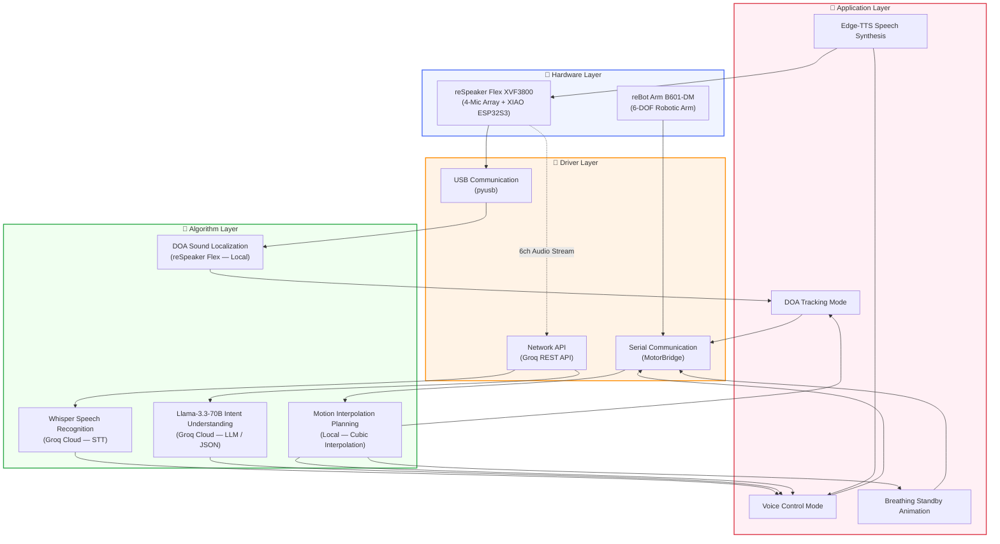
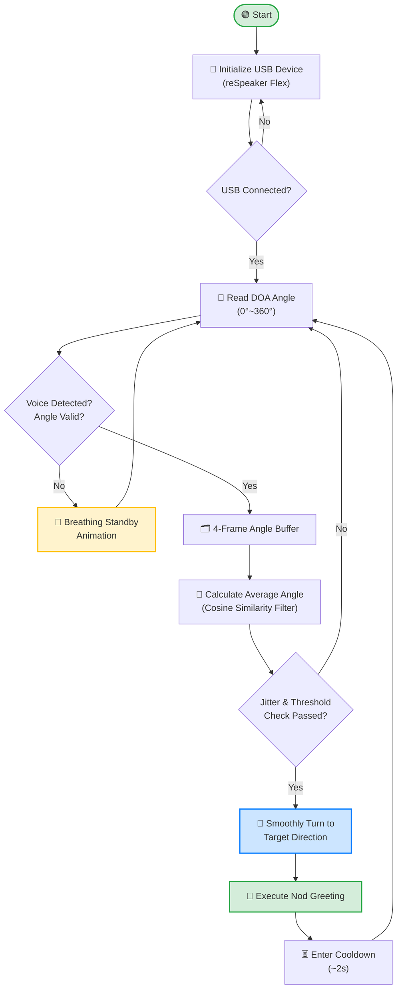
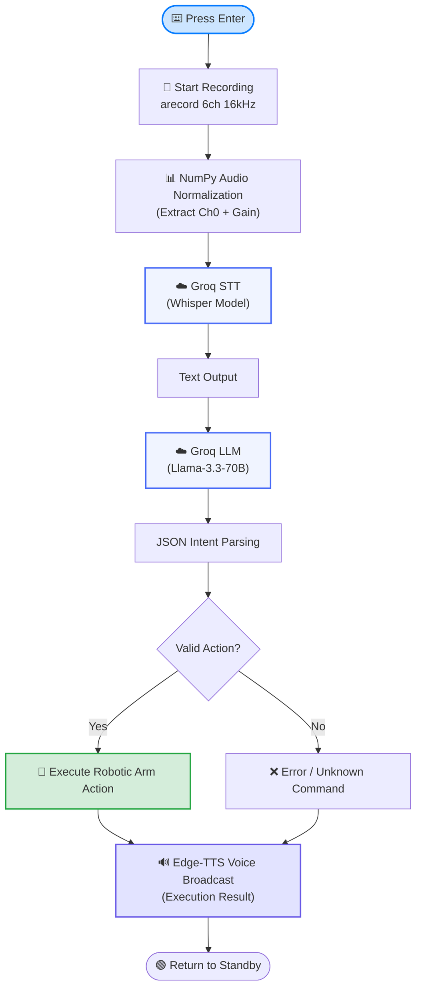
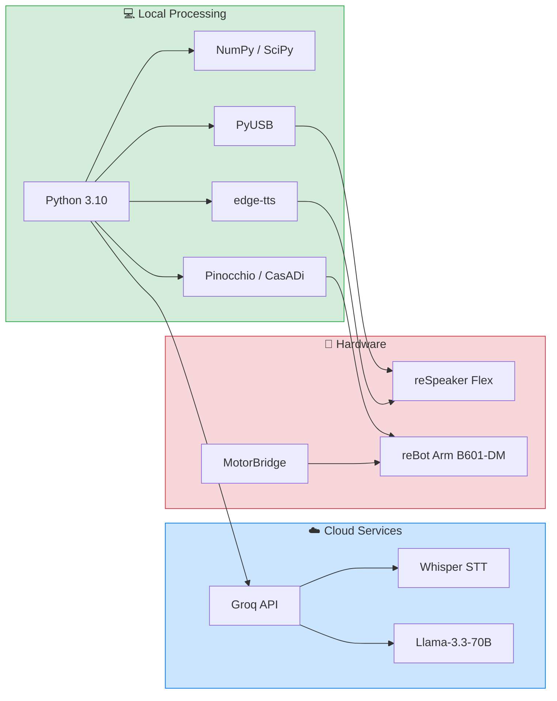

# reBot Arm + reSpeaker Flex — Voice-Driven Robotic Arm Control

🌐 **English** | [中文](./README.md)

<div align="center">

[](https://www.python.org/)
[](LICENSE)
[](https://ubuntu.com/)
[](https://groq.com/)
[](https://github.com/rany2/edge-tts)

**Voice interaction meets physical robotics — real-time sound source tracking and natural language command control for the reBot Arm B601-DM robotic arm, powered by the reSpeaker Flex microphone array.**

</div>

---

## 📋 Table of Contents

- [Features](#-features)
- [System Architecture](#-system-architecture)
- [Hardware Requirements](#-hardware-requirements)
- [Quick Start](#-quick-start)
- [Mode 1: DOA Sound Source Tracking](#-mode-1-doa-sound-source-tracking)
- [Mode 2: Voice Command Control](#-mode-2-voice-command-control)
- [Command-Line Arguments](#-command-line-arguments)
- [Project Structure](#-project-structure)
- [Safety Notes](#-safety-notes)
- [Tech Stack & Dependencies](#-tech-stack--dependencies)
- [License](#-license)
- [Acknowledgements](#-acknowledgements)

---

## ✨ Features

- 🔊 **Real-time DOA Sound Source Tracking** — Uses the reSpeaker Flex built-in DOA algorithm to detect sound direction and automatically turn the robotic arm toward the speaker.
- 💬 **Natural Language Voice Commands** — Speak naturally to control the robotic arm (turn left, turn right, greet, dance, wave, home, stop) via Groq API (Whisper + Llama-3.3-70B).
- 🔄 **Dual-Mode Scheduling** — Seamlessly switch between DOA tracking and voice command modes at runtime.
- 🧸 **Breathing Standby Animation** — Smooth idle micro-motion when no interaction is detected, giving the arm a lifelike presence.
- 🗣️ **AI Speech Feedback** — Uses Microsoft Edge-TTS to verbally confirm executed actions and provide human-like responses.
- 🛡️ **Anti-Jitter & Safety Protection** — Cosine-similarity angle filtering, cooldown mechanism, and joint limit protection ensure stable and safe operation.
- 📦 **Single-File Deployment** — The entire system is contained in one Python file (`sound_tracking_arm.py`) for easy deployment and maintenance.

---

## 🏗️ System Architecture



---

## 🖥️ Hardware Requirements

| Component | Model | Description | Link |
|-----------|-------|-------------|------|
| Robotic Arm | **reBot Arm B601-DM** | 7-DOF robotic arm with MotorBridge controller | — |
| Microphone Array | **reSpeaker Flex XVF3800** | 4-mic array with XIAO ESP32S3 + built-in DOA algorithm | [Seeed Studio](https://www.seeedstudio.com/ReSpeaker-FAB) |
| Host PC | **Ubuntu 22.04** | x86_64 desktop or laptop with USB port | — |
| Cables | USB-A to USB-C / Micro-USB | For reSpeaker and MotorBridge connection | — |

### Wiring Diagram

```
┌──────────────────┐     USB      ┌──────────────────────┐
│   Ubuntu 22.04   │◄────────────►│   reSpeaker Flex     │
│      Host PC     │              │  XVF3800 (4-Mic)     │
│                  │     USB      └──────────────────────┘
│   ┌──────────┐   │◄──────────────────────────────┐
│   │  Python  │   │                               │
│   │  App     │   │     USB     ┌──────────────┐  │
│   └──────────┘   │◄───────────►│ MotorBridge  │  │
└──────────────────┘             │ (Arm Driver) │  │
                                 └──────┬───────┘  │
                                        │ Serial    │
                                        ▼           │
                                 ┌──────────────┐   │
                                 │ reBot Arm    │   │
                                 │ B601-DM      │   │
                                 │ (6-DOF)      │   │
                                 └──────────────┘   │
                                                    │
                              6ch/16kHz Audio ◄─────┘
```

---

## 🚀 Quick Start

### 1. Prerequisites

- **OS**: Ubuntu 22.04 LTS (x86_64)
- **Python**: 3.10
- **Hardware**: reSpeaker Flex and reBot Arm connected via USB
- **Network**: Internet access (for Groq API calls)

### 2. Install Miniforge

Miniforge supports Windows / Ubuntu / macOS / Jetson / Raspberry Pi:

```bash
# Download and install Miniforge
wget "https://github.com/conda-forge/miniforge/releases/latest/download/Miniforge3-$(uname)-$(uname -m).sh"
bash Miniforge3-$(uname)-$(uname -m).sh
```

### 3. Create Conda Environment via environment.yml

```bash
# One-step environment creation with all dependencies (Conda + pip)
conda env create -f environment.yml

# Activate the environment
conda activate flex
```

### 4. Install System Dependencies & Set Serial Permissions

```bash
# Update packages and install ffmpeg
sudo apt-get update && sudo apt-get install -y ffmpeg

# Grant USB serial port permissions (no sudo required afterward)
sudo chmod 666 /dev/ttyACM*
```

### 5. Install uv (Fast Python Environment Tool)

```bash
curl -LsSf https://astral.sh/uv/install.sh | sh
```


### 6. Clone Library, Sync Deps & Configure PYTHONPATH

```bash
git clone https://github.com/vectorBH6/reBotArm_control_py.git
cd reBotArm_control_py
uv sync
export PYTHONPATH="$PWD:$PYTHONPATH"
```

> ⚠️ **Note**: `export PYTHONPATH` must be re-run after each terminal session.

### 7. Configure Groq API Key

```bash
# Edit sound_tracking_arm.py and replace the api_key in VOICE_CFG with your actual key
```

> 💡 **Get API Key**: Sign up at [Groq Console](https://console.groq.com/keys) to create your API key.

### 8. Network Proxy (If Required)

```bash
# Test connectivity to Groq
ping console.groq.com

# If unreachable, set proxy in VOICE_CFG inside sound_tracking_arm.py:
# "proxy": "http://your-proxy-ip:port"   # e.g. "http://192.168.4.7:7897"
```

### 9. Test & Run

```bash
conda activate flex

# 1. Verify pyusb and numpy
python -c "import usb.core; import numpy; print('✅ pyusb + numpy OK')"

# 2. Verify robot arm library (depends on PYTHONPATH)
python -c "from reBotArm_control_py.actuator import RobotArm; print('✅ Robot Arm Library OK')"

# 3. If both OK, run directly
python sound_tracking_arm.py
```

---

## 🎙️ Mode 1: DOA Sound Source Tracking

In this mode, the robotic arm continuously listens via the reSpeaker Flex 4-mic array, detects the direction of incoming sound, and smoothly turns toward the speaker. When a voice is detected, the arm performs a nod greeting — then returns to a breathing standby animation.

### Workflow



### Key Algorithm Details

| Technique | Purpose |
|-----------|---------|
| **4-Frame Buffer** | Accumulates recent DOA readings to reduce instantaneous noise |
| **Cosine Similarity Filtering** | Measures directional consistency across frames; filters out random jumps |
| **Anti-Jitter Threshold** | Only triggers arm movement when angle delta exceeds a configurable threshold |
| **Cooldown Mechanism** | Prevents rapid re-triggering; ensures smooth gesture transitions |
| **Cubic Interpolation** | Smooth joint trajectories with continuous velocity profiles |

---

## 🗣️ Mode 2: Voice Command Control

In this mode, press **`Enter`** to start a voice command session. The system records 6-channel audio, transcribes it via Groq Whisper, parses the command intent via Llama-3.3-70B, and executes the corresponding robotic arm action with voice feedback.

### Workflow



### Supported Voice Commands

| Command | Action | Description |
|---------|--------|-------------|
| "Turn left" / "Go left" | ↩️ Turn Left | Rotate the arm to the left |
| "Turn right" / "Go right" | ↪️ Turn Right | Rotate the arm to the right |
| "Greet" / "Say hello" | 👋 Greeting | Perform a nod greeting gesture |
| "Dance" / "Let's dance" | 💃 Dance | Execute a pre-programmed dance routine |
| "Wave" / "Wave your hand" | 👋 Wave | Perform a waving motion |
| "Home" / "Go home" | 🏠 Return Home | Return all joints to neutral position |
| "Stop" / "Don't move" | ⛔ Stop | Immediately halt all motion |

### LLM Prompt Strategy

The system sends a structured prompt to Llama-3.3-70B to extract action intent:

```text
You are a robotic arm controller. Parse the user's voice command into JSON:
{"action": "<turn_left|turn_right|greet|dance|wave|home|stop>", "params": {}}
If the command is unclear, respond with {"action": "unknown"}.
```

---

## ⚙️ Command-Line Arguments

```
usage: sound_tracking_arm.py [-h] [--mode {track,voice}] [--device-id DEVICE_ID]
                              [--threshold THRESHOLD] [--cooldown COOLDOWN]
                              [--verbose]

optional arguments:
  -h, --help            show this help message and exit
  --mode {track,voice}  Startup mode: 'track' for DOA tracking (default),
                        'voice' for voice command control
  --device-id DEVICE_ID
                        USB device ID of the reSpeaker (default: auto-detect)
  --threshold THRESHOLD
                        DOA angle change threshold in degrees for anti-jitter
                        (default: 15)
  --cooldown COOLDOWN   Cooldown period in seconds after greeting (default: 2.0)
  --verbose, -v         Enable verbose debug output
```

### Usage Examples

```bash
# Start in DOA tracking mode (default)
python sound_tracking_arm.py

# Start in voice command mode
python sound_tracking_arm.py --mode voice

# Custom DOA threshold and cooldown
python sound_tracking_arm.py --threshold 10 --cooldown 3.0

# Verbose debug output
python sound_tracking_arm.py --verbose
```

---

### Core Classes Overview

| Class | Responsibility |
|-------|---------------|
| **`ReSpeaker`** | USB communication with the reSpeaker Flex device; reads real-time DOA angle data (0°–360°) via pyusb |
| **`ArmCtrl`** | Robotic arm control; joint motion interpolation, trajectory planning, joint limit protection, and MotorBridge serial communication |
| **`VoiceAsst`** | Full voice pipeline; audio recording (arecord), STT via Groq Whisper, intent parsing via Llama-3.3-70B LLM, and TTS via edge-tts |
| **`SysMain`** | Main control system; state machine management, dual-mode scheduling, thread coordination, and system lifecycle management |

---

## ⚠️ Safety Notes

> 🛡️ **Please read these safety guidelines carefully before operating the robotic arm.**

### Joint Limits (URDF Physical Constraints)

All joints use radians (rad) in code; both radian and degree values are provided below. Home position is 0 for all joints.

| Joint |      Name      | Min (rad) | Max (rad) | Min (deg) | Max (deg) |     Description    |
| :---: | :------------: | :-------: | :-------: | :-------: | :-------: | :----------------: |
|   J1  |  Base Rotation |    -2.6   |    +2.6   |  -149.0°  |  +149.0°  |   Horizontal yaw   |
|   J2  | Shoulder Pitch |    -3.6   |    0.0    |  -206.3°  |     0°    |   Upper arm lift   |
|   J3  |   Elbow Pitch  |    -3.6   |    0.0    |  -206.3°  |     0°    |  Forearm extension |
|   J4  |   Wrist Roll   |    -1.5   |    +1.5   |   -85.9°  |   +85.9°  |  End-effector roll |
|   J5  |   Wrist Pitch  |    -1.5   |    +1.5   |   -85.9°  |   +85.9°  | End-effector pitch |
|   J6  |    Wrist Yaw   |    -1.5   |    +1.5   |   -85.9°  |   +85.9°  |  End-effector yaw  |
|   J7  |     Gripper    |    -5.6   |    0.0    |  -320.9°  |     0°    | Gripper open/close |


### Operating Precautions

1. **Clear Workspace** — Ensure the arm's full range of motion is unobstructed before powering on.
2. **Power On Sequence** — Always power the MotorBridge controller **before** launching the Python script.
3. **Emergency Stop** — Press `Ctrl+C` in the terminal or shout `"Stop!"` in voice mode to immediately halt all motion.
4. **DOA Mode Caution** — In tracking mode, the arm will actively turn toward loud sounds. Keep people and fragile objects away from the arm's movement path.
5. **USB Connection** — Do not disconnect the reSpeaker or MotorBridge USB cables during operation; this may cause uncontrolled arm behavior.
6. **Joint Limit Protection** — The software enforces joint limits, but hardware-level protection is the responsibility of the operator.

---

## 🛠️ Tech Stack & Dependencies

### Runtime Dependencies

| Package | Version | Purpose |
|---------|---------|---------|
| **Python** | 3.10 | Programming language |
| **pyusb** | latest | USB communication with reSpeaker Flex |
| **numpy** | latest | Audio signal processing and numerical computation |
| **scipy** | latest | Scientific computing utilities |
| **groq** | latest | Groq API client for Whisper STT and Llama-3.3 LLM |
| **edge-tts** | latest | Microsoft Edge Text-to-Speech synthesis |
| **pinocchio** | conda-forge | Rigid body dynamics and kinematics |
| **casadi** | conda-forge | Numerical optimization for motion planning |
| **libusb** | conda-forge | Low-level USB driver support |

### External Tools

| Tool | Purpose |
|------|---------|
| **arecord** | ALSA audio recorder for 6-channel/16kHz microphone capture |
| **Groq Cloud API** | Whisper (STT) + Llama-3.3-70B (LLM intent parsing) |

### System Architecture Technologies



---

## 📄 License

This project is licensed under the **MIT License** — see the [LICENSE](LICENSE) file for details.

```
MIT License

Copyright (c) 2025 reBot Arm + reSpeaker Flex Project Contributors

Permission is hereby granted, free of charge, to any person obtaining a copy
of this software and associated documentation files (the "Software"), to deal
in the Software without restriction, including without limitation the rights
to use, copy, modify, merge, publish, distribute, sublicense, and/or sell
copies of the Software, and to permit persons to whom the Software is
furnished to do so, subject to the following conditions:

The above copyright notice and this permission notice shall be included in all
copies or substantial portions of the Software.

THE SOFTWARE IS PROVIDED "AS IS", WITHOUT WARRANTY OF ANY KIND, EXPRESS OR
IMPLIED, INCLUDING BUT NOT LIMITED TO THE WARRANTIES OF MERCHANTABILITY,
FITNESS FOR A PARTICULAR PURPOSE AND NONINFRINGEMENT. IN NO EVENT SHALL THE
AUTHORS OR COPYRIGHT HOLDERS BE LIABLE FOR ANY CLAIM, DAMAGES OR OTHER
LIABILITY, WHETHER IN AN ACTION OF CONTRACT, TORT OR OTHERWISE, ARISING FROM,
OUT OF OR IN CONNECTION WITH THE SOFTWARE OR THE USE OR OTHER DEALINGS IN THE
SOFTWARE.
```

---

## 🙏 Acknowledgements

This project stands on the shoulders of the following excellent open-source projects and communities:

| Project / Organization | Contribution |
|------------------------|-------------|
| **[Seeed Studio](https://www.seeedstudio.com/)** | Developed the reSpeaker Flex microphone array and reBot Arm B601-DM hardware |
| **[Groq](https://groq.com/)** | Provided ultra-fast cloud inference for Whisper STT and Llama-3.3-70B LLM |
| **[Whisper](https://github.com/openai/whisper)** by OpenAI | State-of-the-art open-source speech recognition model |
| **[Llama](https://ai.meta.com/llama/)** by Meta AI | Open-source large language model for natural language understanding |
| **[edge-tts](https://github.com/rany2/edge-tts)** | Python interface for Microsoft Edge Text-to-Speech service |
| **[Pinocchio](https://github.com/stack-of-tasks/pinocchio)** | Efficient rigid body dynamics and kinematics library |
| **[CasADi](https://web.casadi.org/)** | Symbolic framework for numeric optimization |
| **[PyUSB](https://github.com/pyusb/pyusb)** | Python USB access library |

---

<div align="center">

**Made with ❤️ for robotics and voice interaction enthusiasts.**

If you find this project useful, please consider giving it a ⭐ on GitHub!

[🔝 Back to Top](#-rebot-arm--respeaker-flex--voice-driven-robotic-arm-control)

</div>
